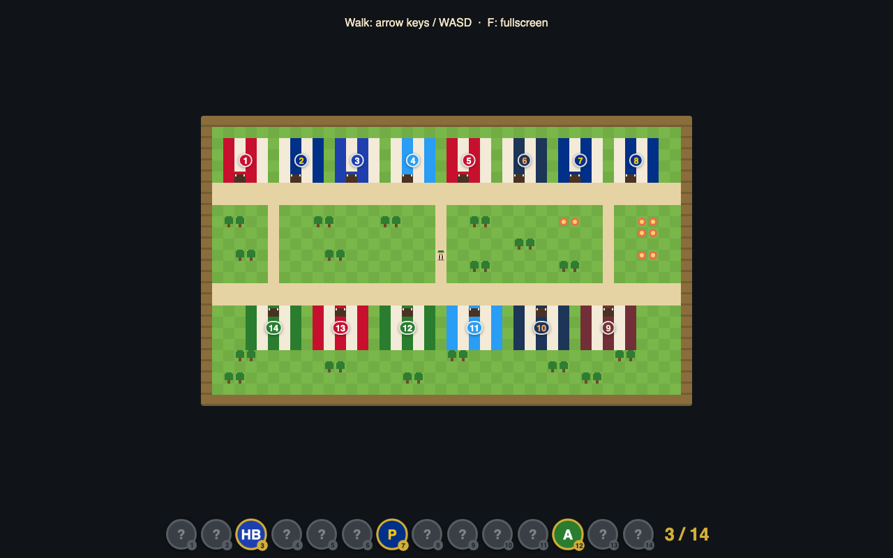

# Wiesn Quest 🍺

A tiny Pokémon-style Oktoberfest game for the browser: walk the Theresienwiese,
step into all **14 big beer tents**, and collect each tent's beer-brand badge.
Collect all 14 and... *O'zapft is!*

Built for a party big screen: no build step, no dependencies, no assets.



## Run it

Double-click `index.html`. That's it.

If your browser is picky about `file://` pages, run one command instead:

```sh
python3 -m http.server
```

and open <http://localhost:8000>. For the party: laptop + HDMI + Chrome, press **F** for fullscreen.

## Play it

| Key | Action |
|-----|--------|
| Arrows / WASD | walk (tap to turn, hold to walk) |
| Enter / Space | confirm popups |
| F | fullscreen |
| ` (backtick) | debug mode |

Step onto a tent's doorway to take its challenge and win its badge. The tray at
the bottom shows your 14 badge slots.

## Debug it

Open with `?debug=1` (or press backtick). You get: tile grid + coordinates, red
tint on solid tiles, highlighted entrances, and a live stats panel. Debug
hotkeys: `1-9 0 - = [ ]` teleport to tents 1–14, `B` grant next badge, `N` grant
all, `E` force an encounter, `R` reset.

The console always has helpers, e.g. `game.give('hofbraeu')`, `game.teleport(21,12)`,
`game.winNow()`, `game.reset()` — and `game.state` is the entire game state.

## Which file owns what

| Symptom / task | File |
|---|---|
| Wrong tent name, beer, badge color, greeting | `js/tents.js` |
| Change the map (it's ASCII art!), walked through a wall | `js/map.js` |
| Tune speed, encounter odds, NPC count, colors, start position | `js/config.js` |
| Looks wrong (canvas drawing, scaling) | `js/draw.js` |
| Crowd walking wrong, stuck NPCs | `js/npcs.js` |
| Behaves wrong (movement, input, badges, win) | `js/game.js` |
| Popups, badge tray, win screen, sounds | `js/ui.js` |
| **Add a real challenge for a tent** | `js/challenges.js` (registry — see comment there) |
| **Add / edit a random encounter** | `js/encounters/` (one file each — see the README there) |
| Encounter dice roll & kickoff | `js/encounters.js` |
| The battle screen (flash, sprites, text box) | `js/battle.js` + the battle section of `style.css` |
| Debug overlay & hotkeys | `js/debug.js` |

Everything is plain `<script>` tags sharing globals — deliberately no ES modules
and no `fetch()`, so the double-click `file://` launch keeps working.

## Random encounters

While walking, there's a small chance per step of a wild encounter — complete
with the Game Boy grass-flash, a battle screen (you in Lederhosen lower-left,
the encounter upper-right) and a typewriter text box. Try one from the console:
`game.encounterNow('ice')`. Everything that can appear lives in
`js/encounters/`, one file per encounter — adding your own is a 5-minute job,
see the README in that folder.

## Still to come

- Real challenges inside each tent (the `CHALLENGES` registry is the plug-in point)
- Encounters that fight back (give an entry a `run()` — see `js/encounters/README.md`)
